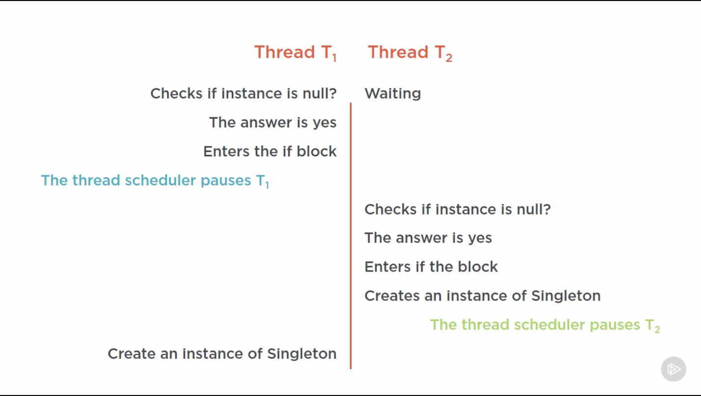

## THREADING

Concurency is the art of doing several things at the same time.

An application can be composed of many threads

The jvm works with several threads. e.g the garbage collector and the JIT

The scheduler allocates time for each thread.

### _Three rules for allocating cpu time to threads_

- The cpu must be shared equally among threads.
- Thread is waiting for data (reading and writing.)
- thread might be waiting another resource.

### Race condition

- Race condition occur when two different threads are trying to read and write a variable at the same time. (Concurent reading and writing)

Synchronization solves this issue.

You add the `synchronized` key word before the return value of the `getInstance` method.

### How does synchronize work

Synchronize gives the object key to the first thread that tries to run the synchrinized method. Any thread that asks for that key would have to wait until it is returned by the thread using it.

This key is also called a monitor;

Look at the different ways to specify the key.
and how the key is used for different synchronized items in the class/object
Learn reentrant locks and dead locks
